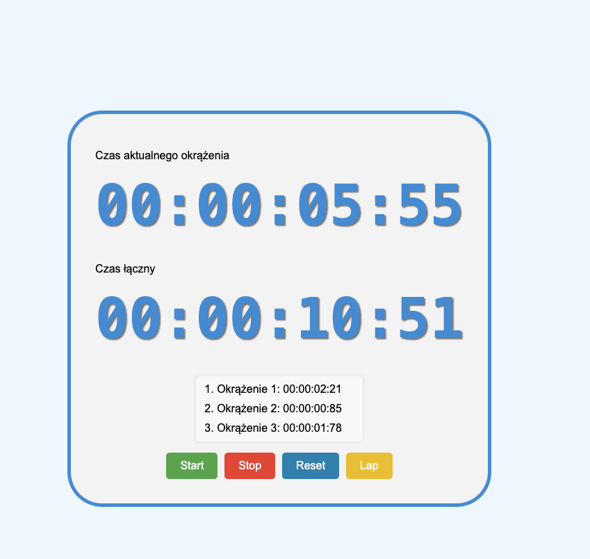

# Stopwatch App - README

## Opis aplikacji

Aplikacja **Stopwatch** jest prostym projektem zaliczeniowym dla bootcampu Frontowcy, który umożliwia naukę podstaw React i TypeScript w praktyce. Używa narzędzia Vite do szybkiego budowania i uruchamiania aplikacji.

Aplikacja **Stopwatch** to cyfrowy stoper, napisany w języku TypeScript z użyciem biblioteki React. Stoper pozwala na pomiar czasu, dodawanie okrążeń oraz resetowanie pomiarów. Komponenty zostały podzielone na moduły, co ułatwia modyfikację, utrzymanie i ponowne użycie kodu.



## Struktura Aplikacji

Aplikacja jest podzielona na kilka komponentów, które są odpowiedzialne za różne części funkcjonalności stopera:

1. **Stopwatch.tsx** - główny komponent aplikacji, zarządzający stanami i logiką stopera. Obsługuje funkcje takie jak uruchamianie, zatrzymywanie, resetowanie i dodawanie okrążeń.

2. **Display.tsx** - komponent odpowiedzialny za wyświetlanie aktualnego czasu. Może być używany do wyświetlania zarówno całkowitego czasu, jak i czasu okrążenia.

3. **Laps.tsx** - komponent odpowiedzialny za wyświetlanie listy zapisanych okrążeń. Każde okrążenie jest zapisywane wraz z czasem jego trwania.

4. **Controls.tsx** - komponent odpowiedzialny za przyciski sterujące, takie jak _Start_, _Stop_, _Reset_ i _Lap_.

5. **Stopwatch.scss** - plik stylów, w którym definiowane są style aplikacji, zapewniające przyjemny interfejs użytkownika.

## Funkcjonalności

- **Start**: Rozpoczyna pomiar czasu od bieżącej wartości lub wznawia go po zatrzymaniu.
- **Stop**: Zatrzymuje pomiar czasu, umożliwiając jego późniejsze wznowienie.
- **Reset**: Resetuje wszystkie wartości czasu i usuwa wszystkie zapisane okrążenia.
- **Lap**: Dodaje nowe okrążenie i zapisuje czas, odnotowując czas od ostatniego okrążenia.

Każda z tych funkcji jest realizowana za pomocą osobnych stanów i funkcji zarządzanych w głównym komponencie **Stopwatch**.

## Instalacja i uruchomienie

1. Sklonuj repozytorium:

   ```bash
   git clone https://github.com/MariuszRudnik/Frontowcy-stopwatch
   ```

2. Przejdź do katalogu projektu:

   ```bash
   cd stopwatch-app
   ```

3. Zainstaluj zależności:

   ```bash
   npm install
   ```

4. Uruchom aplikację:
   ```bash
   npm run dev
   ```

Aplikacja uruchomi się w trybie deweloperskim na lokalnym serwerze.

## Wymagania

- **Node.js** w wersji 20.x lub nowszej

## Technologie

- **Vite**: Narzędzie do szybkiego budowania i uruchamiania aplikacji
- **React**: Biblioteka do tworzenia interfejsów użytkownika
- **TypeScript**: Superset JavaScriptu dodający statyczne typowanie
- **SCSS**: SASS do tworzenia stylów, który oferuje zagnieżdżone reguły i zmienne dla lepszego zarządzania stylami

## Przykłady użycia

Aplikacja może być wykorzystywana do różnego rodzaju aktywności sportowych, w których wymagane jest dokładne śledzenie czasu, takich jak biegi, treningi siłowe czy jazda na rowerze. Funkcja dodawania okrążeń pozwala użytkownikom na rejestrowanie różnych odcinków trasy, co jest szczególnie przydatne podczas biegania na stadionie lub jazdy na rowerze.
